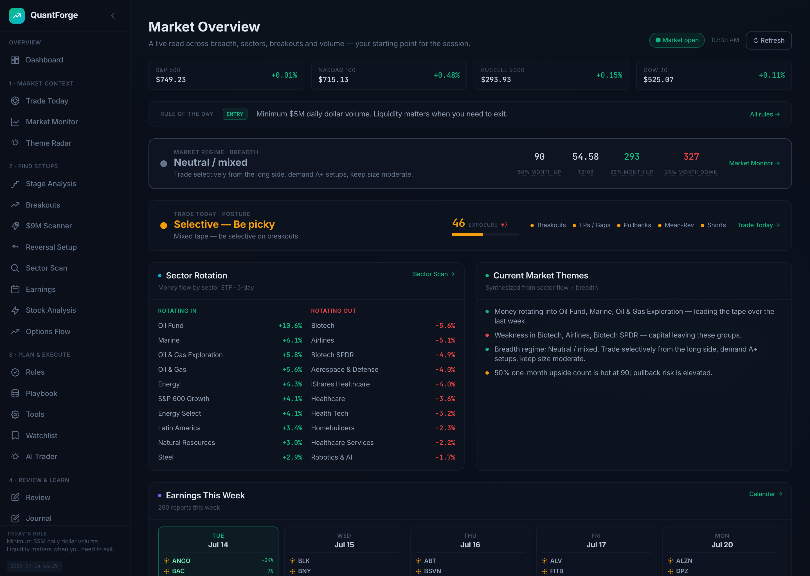
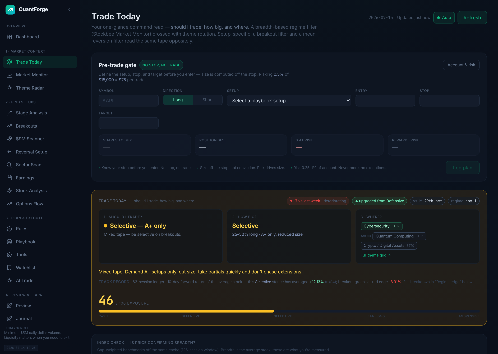
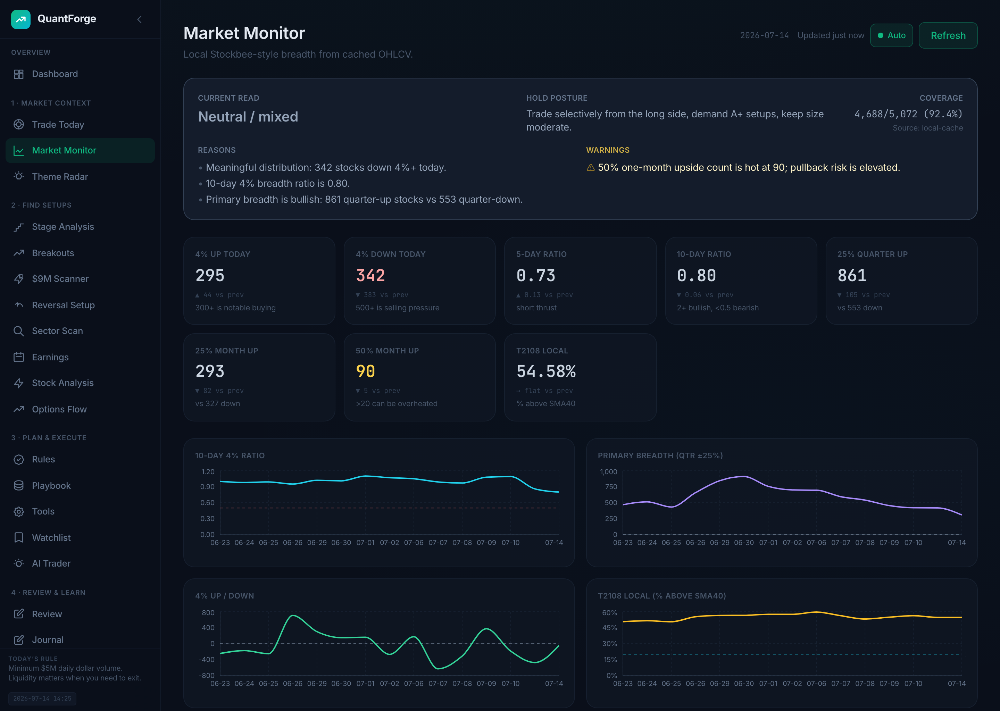
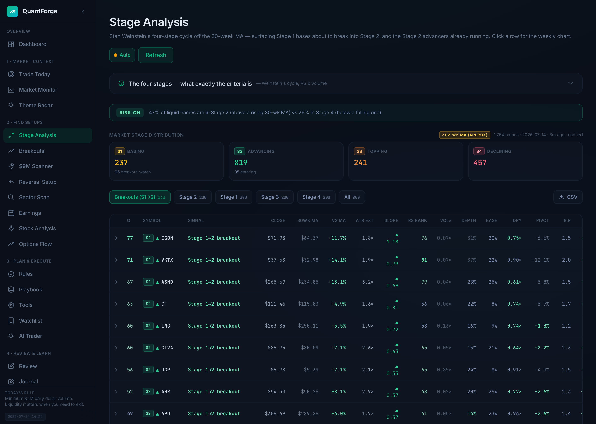
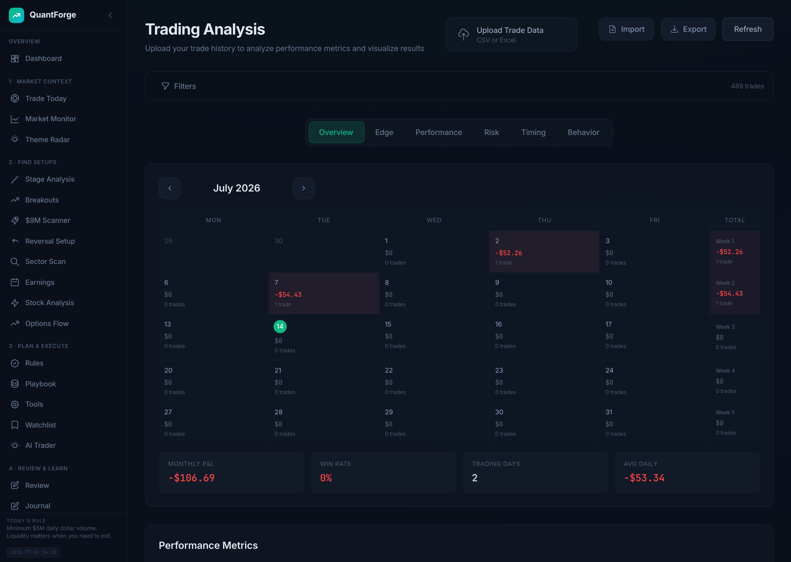

# QuantForge

A full-stack, **local-first** trading platform: it reads market breadth, surfaces
setups, enforces pre-trade discipline, and turns your real Interactive Brokers
fill history into edge analytics — all in one dark fintech dashboard.

The app is organized around a trading **workflow**, not a pile of tools:
**read the market → find setups → plan & execute → review & learn.**



---

## What it does

### Overview
- **Dashboard / Market Overview** — a live read across indices, breadth regime,
  Trade Today posture, sector rotation, and synthesized market themes. Your
  one-glance starting point for the session.

### 1 · Market Context
- **Trade Today** — the command page: *should I trade, how big, and where.* A
  breadth-based regime filter (Stockbee Market Monitor) crossed with theme
  rotation, plus a **pre-trade gate** (define setup, stop, and target → size is
  computed off the stop) and a persistent daily ledger with 1-year percentile
  context and forward-return backtest.
- **Market Monitor** — Stockbee-style breadth across the active US common-stock
  universe (~5,000 names): 4% up/down movers, 5/10-day thrust ratios,
  quarterly/monthly ±25% leadership, and a local T2108 (% above 40-day SMA).
- **Theme Radar** — structural theme strength × real-time tape velocity → a
  near-term velocity matrix that flags sweet spots vs distribution traps.

### 2 · Find Setups
- **Stage Analysis** — Weinstein's four-stage cycle off the 30-week MA; surfaces
  Stage 1 bases about to break into Stage 2 and the Stage 2 advancers running.
- **Breakouts (Ranked Chart Wall)** — Day 1/2/3+ of sustained ≥2× volume with a
  directional accumulation score, short-volume %, and optional institutional
  (Form 4 + 13-F) enrichment.
- **$9M Scanner** — episodic-pivot / gap scanner with a deterministic scorer.
- **Reversal Setup** — mean-reversion / reversal candidates.
- **Sector Scan** — live sector/industry ETF performance plus rotation intelligence: per-sector **internals** computed from members, not the cap-weighted ETF (%>50MA, up/down dollar-volume, stealth-accumulation flags), an **RRG quadrant chart** (RS vs SPY × RS momentum with weekly trails), and a click-through **leaders drill-down** ranking each sector's strongest members by cross-sectional RS.
- **Earnings** — beat/miss + reaction calendar.
- **Stock Analysis** — per-symbol news + AI criteria analysis.
- **Options Flow** — Unusual-Whales-style unusual options activity.

### 3 · Plan & Execute
- **Rules** — your codified playbook: MA rails, volume metrics, candle tells,
  weekly-rail guidance.
- **Playbook** — annotated setup library with chart screenshots.
- **Tools** — Position Sizer (Fixed %, Kelly, ATR) and a customizable pre-trade
  discipline checklist.
- **Watchlist** — tracked names.
- **AI Trader** — AI-generated trade ideas with quant analytics and a
  point-in-time backtester (scale-out + MA-trail exit model).
- **Bot Trader** — connect to TWS / IB Gateway (paper or live), view account,
  positions and orders, and place Market/Limit/Stop orders behind a confirmation
  modal. US stocks only (IIROC 3200A). Endpoints disappear entirely if
  `ib_insync` isn't installed.

### 4 · Review & Learn
- **Review** — edit setup / grade / emotion / notes per trade (sidecar-backed).
- **Journal** — pre/post-trade plan, emotions, lessons, execution rating, tags.
- **Trading Analysis** — win rate, profit factor, Sharpe/Sortino, expectancy,
  P&L calendar heatmap, hold-time scatter, streak/tilt detection, entry-timing,
  setup/symbol/market-cap breakdowns, SPY benchmark & alpha, R-multiple and
  rolling/drawdown analytics.
- **Wealthsimple** — separate-account analysis.
- **Yearly Strongest** — strongest names by year.

### Research & Validation
- **Edge Validation** — cross-sectional, anti-overfitting checks on a signal.
- **Factor Model** — cross-sectional factor ranking.
- **Backtesting** — Previous-Day Breakout, SMA Crossover, RSI, Mean Reversion,
  Buy & Hold; single- and multi-symbol with equity curves and full trade logs.
- **Signal Lab / Bot Trader** — experiments and broker execution.

> Every read is built to be **auditable** — score build-ups off a neutral
> baseline, per-factor scoring criteria, data-provenance disclosure, and a
> pipeline verifier that recounts on-screen numbers straight from the raw cached
> bars. Reads are backward-looking regime filters, *not* timing signals.

---

## Screenshots

| Trade Today — command page | Market Monitor — breadth |
|---|---|
|  |  |
| **Stage Analysis — ranked setups** | **Trading Analysis — edge analytics** |
|  |  |

---

## Tech Stack

| Layer    | Technology                                                        |
|----------|-------------------------------------------------------------------|
| Backend  | Python, FastAPI, pandas, NumPy, openpyxl, yfinance, ib_insync     |
| Frontend | React 18, Vite, Tailwind CSS, Recharts, lightweight-charts        |
| Broker   | Interactive Brokers (TWS / IB Gateway) via `ib_insync`            |
| AI       | Anthropic API (Claude) for trade ideas, criteria, and theme reads |
| Data     | Massive (grouped-daily EOD, primary), Yahoo Finance & Finnhub (fallback), Excel trade files, JSON + sqlite storage |

Two processes: a FastAPI backend on **:8000** and a React/Vite frontend on
**:5173** that proxies `/api/*` to the backend. Runtime state is file-based
(JSON + `screener_snapshots.db` under `backend/data/`) — there is no database
server.

---

## Quick Start

### Prerequisites
- Python 3.10+
- Node.js 18+
- (Optional) TWS or IB Gateway for Bot Trader

### One command

```bash
./start.sh   # creates the venv / installs deps on first run, then starts both
```

Then open **http://localhost:5173**.

### Or run each process yourself

```bash
# Backend
cd backend
python -m venv venv && source venv/bin/activate   # Windows: venv\Scripts\activate
pip install -r requirements.txt
uvicorn main:app --reload --port 8000

# Frontend (in a second terminal)
cd frontend
npm install
npm run dev
```

### Configuration

Copy `backend/.env.example` → `backend/.env` and fill in what you need (a
project-root `.env` also works). Everything has a sensible default; keys are
only required for the features that use them.

| Variable              | Purpose                                                        |
|-----------------------|----------------------------------------------------------------|
| `DEFAULT_TRADES_PATH` | Default trades Excel workbook for Trading Analysis / Review     |
| `MASSIVE_API_KEY`     | Primary market-data provider (breadth, screeners, calendar)    |
| `FINNHUB_API_KEY`     | Fallback news / earnings provider                              |
| `ANTHROPIC_API_KEY`   | AI Trader, Theme Radar, and stock-criteria analysis            |
| `QF_DATA_PROVIDER`    | OHLCV provider switch — `massive` (default) or `yahoo`          |
| `QF_NEWS_PROVIDER`    | News provider switch — `massive` (default) or `finnhub`        |
| `IB_HOST` / `IB_PORT` / `IB_CLIENT_ID` / `IB_PAPER` | Interactive Brokers connection    |
| `QF_LOG_LEVEL`        | Set `DEBUG` for per-symbol enrichment logs                     |

**Interactive API docs** are auto-generated by FastAPI at
**http://localhost:8000/docs** — the authoritative, always-current list of every
endpoint. (This README no longer duplicates the full endpoint table; each
backend feature is a self-contained router registered in `backend/main.py`.)

---

## Security

QuantForge is **single-user and localhost-bound** — see **[SECURITY.md](SECURITY.md)**
for the full threat model. Controls in place:

- **No open network surface** — uvicorn binds `127.0.0.1`; CORS is locked to the
  two localhost frontend origins (no wildcard). There is no auth layer, so *you*
  own any exposure if you tunnel or reverse-proxy the app.
- **Uploads** are size-capped (25 MB → clean `413`) and type-restricted; stored
  filenames are always server-generated, never the client's.
- **Served file paths** are contained to their directory (path-traversal safe).
- **Secrets** live only in `backend/.env` (git-ignored); `.env.example` ships
  placeholders. Startup logging reports only "set / missing", never a key value.
- **Broker actions** (real order placement) sit behind an explicit confirmation
  modal and a Paper/Live toggle.

---

## Project Structure

```
quantforge/
├── backend/
│   ├── main.py                # FastAPI app, middleware, backtesting + analytics endpoints
│   ├── breadth/               # Market-context engine (Trade Today / Market Monitor / SA)
│   ├── scanners/              # $9M, reversal, stage-analysis scanners
│   ├── analytics/             # Factor model + edge validation
│   ├── screener/qullamaggie/  # Breakout screener (providers, scoring, sqlite cache)
│   ├── theme_radar/           # Theme-velocity analysis
│   ├── ai_trader/, advisor/   # AI-powered analysis (Anthropic)
│   ├── options_flow/, news/, broker/, formatter/
│   ├── *_router.py            # Single-file routers (journal, calendar, movers, trade_plans, …)
│   ├── market_clock.py        # effective_cache_ttl() — closed-market cache extension
│   ├── ep_scorer.py           # Deterministic Qullamaggie EP scorer
│   └── data/                  # Runtime state: JSON + screener_snapshots.db (git-ignored)
├── frontend/
│   └── src/
│       ├── pages/             # One component per route (code-split in App.jsx)
│       ├── api/               # One client module per backend router
│       ├── components/        # Shared UI (Layout, RefreshControl, analysis/, review/, …)
│       └── autorefresh/       # Background daily-warm queue + serial refresh
├── docs/screenshots/          # README imagery
├── start.sh
├── SECURITY.md
├── CLAUDE.md                  # Guidance for AI coding assistants
└── README.md
```

> The trade-log **formatter** that turns Interactive Brokers PDF reports into the
> trades workbook lives in a **separate sibling repo** (`../trade-log-formatter`);
> `backend/formatter/` is a thin wrapper that shells out to it and streams
> progress to the UI. See `CLAUDE.md` for the full trade-data pipeline.

---

## Notes

- **Personal project** — there is no test suite and no linter configured;
  `screener/qullamaggie/test_fetch.py` is a manual data-provider sanity script.
- **Not financial advice.** The screeners and regime reads are research tools.

## License

MIT
